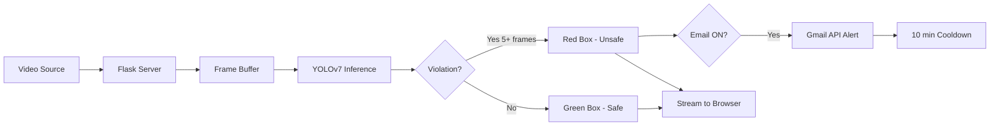

# PPE Violation Detection System

Real-time safety monitoring app that detects missing helmets & jackets on workers using YOLOv7 object detection, streams annotated video through a Flask web dashboard, and fires email alerts via the Gmail API when violations persist.

---

## How It Works



**In short**: Video comes in → frames get buffered → YOLOv7 runs detection → if a worker is missing helmet/jacket for 5+ consecutive frames → email alert fires (with a 10-min cooldown so your inbox doesn't explode) → annotated stream is pushed to the browser.

---

## Model & Dataset Details

| Item | Detail |
|------|--------|
| **Model** | YOLOv7 (from [WongKinYiu/yolov7](https://github.com/WongKinYiu/yolov7)) |
| **Weights** | `best.pt` — custom-trained on PPE dataset |
| **Dataset** | [Roboflow PPE Detection v2](https://universe.roboflow.com/ppe-detection-csg9b/ppe-detection-siklb/dataset/2) (CC BY 4.0) |
| **Classes (4)** | `0: no helmet`, `1: no jacket`, `2: safe`, `3: unsafe` |
| **Input Size** | 640×640 |
| **Confidence Threshold** | 0.25 (configurable) |
| **NMS IoU Threshold** | 0.45 |
| **Device** | CPU by default, GPU supported (`0` or `0,1,2,3`) |

### Violation Logic
- Classes `0` (no helmet), `1` (no jacket), `3` (unsafe) = **violation**
- Class `2` (safe) = **compliant**
- Violation must persist for **≥ 5 consecutive frames** before triggering an alert
- Email cooldown: **10 minutes** between alerts

---

## Tech Stack

| Layer | Tool |
|-------|------|
| Detection Model | YOLOv7 + PyTorch |
| Web Server | Flask |
| Video Processing | OpenCV (`cv2`) |
| Email Alerts | Gmail API (Google OAuth 2.0) |
| Containerization | Docker |
| Frontend | HTML/CSS (Jinja2 templates) |

---

## Project Structure

```
PPE-VIOLATION-DETECTION/
├── app.py                  # Flask routes: upload, stream, inference, email toggle, report download
├── hubconfCustom.py        # YOLOv7 inference loop, bounding box drawing, violation logic, email trigger
├── send_mail.py            # Gmail API auth (OAuth), email creation with image attachment
├── requirements.txt        # Python dependencies
├── Dockerfile              # Container setup (python:3.8-slim-buster)
├── Gmail-API.pdf           # Google Cloud setup reference
├── data/
│   ├── custom_data.yaml    # Class names & Roboflow dataset paths
│   ├── coco.yaml           # Default COCO classes
│   └── hyp.scratch.*.yaml  # Training hyperparameters
├── models/
│   ├── common.py           # YOLOv7 layers (Conv, Bottleneck, SPPCSPC, etc.)
│   ├── experimental.py     # Model loading (attempt_load)
│   └── yolo.py             # Network architecture parser
└── static/
    └── css/styles.css      # Dashboard styling
```

### What's NOT in the repo (you need to add these)

| Missing File | Why You Need It |
|---|---|
| `utils/` directory | YOLOv7 helper functions (`general.py`, `plots.py`, `torch_utils.py`, `google_utils.py`). Copy from [WongKinYiu/yolov7](https://github.com/WongKinYiu/yolov7). |
| `templates/index.html` | Flask UI template. The dashboard page. |
| `best.pt` | Trained YOLOv7 weights for the 4 PPE classes. |
| `client_secrets.json` | Google OAuth credentials for Gmail API. |
| `static/video/`, `static/files/`, `static/violations/`, `static/reports/` | Runtime directories for uploads, default video, violation snapshots, and reports. |

---

## Setup Steps

### 1. Clone & create virtual environment
```bash
git clone <repo-url>
cd PPE-VIOLATION-DETECTION
python -m venv venv
venv\Scripts\activate        # Windows
# source venv/bin/activate   # macOS/Linux
```

### 2. Install dependencies
```bash
pip install -r requirements.txt
```

### 3. Copy YOLOv7 utils
```bash
git clone https://github.com/WongKinYiu/yolov7.git temp_yolo
xcopy /E /I temp_yolo\utils utils   # Windows
# cp -r temp_yolo/utils ./utils     # macOS/Linux
rmdir /S /Q temp_yolo               # cleanup
```

### 4. Add model weights
Place your trained `best.pt` file in the project root.

### 5. Create runtime directories
```bash
mkdir static\video static\files static\violations static\reports
```
Drop a sample `vid.mp4` into `static/files/` — the app copies it to `static/video/` on startup.

### 6. Create `templates/index.html`
Create the `templates/` folder and add an HTML file. The Flask app renders this as the dashboard. It should include:
- Two `` tags pointing to `/video_raw` and `/video_processed` endpoints
- Forms posting to `/submit` with fields: `video` (file upload), `inference_video_button`, `live_inference_textbox` + `live_inference_button`, `download_button`, `alert_email_checkbox` + `alert_email_textbox`
- Link to `static/css/styles.css`

### 7. Gmail API setup (for email alerts)
1. Go to [Google Cloud Console](https://console.cloud.google.com/) → create project → enable **Gmail API**
2. OAuth Consent Screen → External → add scope `gmail.send` → add yourself as test user
3. Credentials → OAuth Client ID → Desktop App → download as `client_secrets.json` → place in project root
4. First email attempt opens a browser for authorization → generates `token.json` automatically

### 8. Update sender/recipient emails
In `hubconfCustom.py` (lines 30-31):
```python
email_sender = 'your-email@gmail.com'
email_recipient = 'recipient@gmail.com'
```

---

## Run

### Locally
```bash
python app.py
```
Open `http://127.0.0.1:5000/`

### Docker
```bash
docker build -t ppe-detector .
docker run -p 5000:5000 ppe-detector
```

---

## Key Config (hubconfCustom.py)

```python
opt = {
    "weights": "best.pt",
    "yaml": "data/custom_data.yaml",
    "img-size": 640,
    "conf-thres": 0.25,
    "iou-thres": 0.45,
    "device": "cpu",       # change to "0" for GPU
    "classes": None         # filter specific classes or None for all
}
```

- **Email cooldown**: `time.sleep(600)` in `violation_alert_generator()` — change `600` to adjust gap between alerts
- **Inference confidence on processed stream**: hardcoded to `0.75` in `app.py` line 127

---

## Flask Routes

| Route | Method | What it does |
|-------|--------|-------------|
| `/` | GET/POST | Serves dashboard |
| `/video_raw` | GET | Streams raw video frames |
| `/video_processed` | GET | Streams YOLOv7-annotated frames |
| `/submit` | POST | Handles uploads, inference triggers, IP cam input, report download, email toggle |

---

## License
MIT